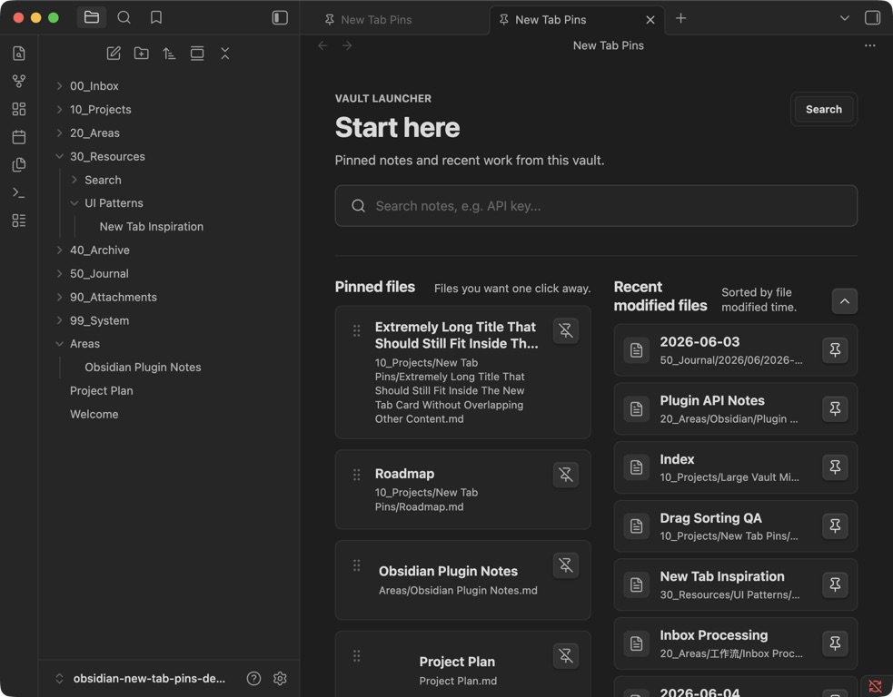

# New Tab Pins

Turn every empty Obsidian tab into a calm launcher for your vault.



New Tab Pins puts search, important notes, and recent work in one focused home view—without making you build or maintain a dashboard note.

> **Community review:** The plugin has been submitted to the Obsidian Community Plugin directory. Until the review is complete, install it with BRAT or from the latest GitHub release.

## Why New Tab Pins

- **Keep key notes one click away.** Pin a Markdown file from its context menu or drag it onto the home view.
- **Find files immediately.** Search vault files by title or path, including Bases, canvases, and attachments.
- **Resume recent work.** Jump back into recently modified notes.
- **Stay focused.** No statistics, widgets, or dashboard note to maintain.
- **Keep your notes private.** The plugin makes no network requests and never modifies note contents.

## Install the public beta

### BRAT

1. Install and enable the [BRAT](https://github.com/TfTHacker/obsidian42-brat) community plugin.
2. Run **BRAT: Add a beta plugin for testing** from the command palette.
3. Paste this repository URL:

   ```text
   https://github.com/ptspzy/obsidian-new-tab-pins
   ```

4. Enable **New Tab Pins** in **Settings → Community plugins**.

### Manual installation

Download `manifest.json`, `main.js`, and `styles.css` from the [latest release](https://github.com/ptspzy/obsidian-new-tab-pins/releases/latest), then copy them into:

```text
<your-vault>/.obsidian/plugins/new-tab-pins/
```

Reload Obsidian and enable **New Tab Pins** in **Settings → Community plugins**.

## Use it

1. Run **New Tab Pins: Open home tab** from the command palette.
2. Pin a note from the file explorer context menu, or drag a Markdown file onto the pinned area.
3. Drag pinned notes to reorder them.
4. Search your vault or open a recently modified note from the same view.

Available commands:

- **Open home tab**
- **Replace current tab with home**
- **Pin current file**
- **Unpin current file**

## Settings

- Home title and subtitle
- Automatically replace newly focused empty tabs
- Comfortable or compact layout density
- Starter pins used when no notes have been pinned yet

## Privacy and data safety

New Tab Pins:

- does not connect to the internet;
- does not collect analytics;
- does not create, edit, rename, or delete notes;
- stores only its settings and pinned file paths in Obsidian's plugin data.

## Compatibility

The custom home view and commands use stable Obsidian plugin APIs. **Auto-open on empty tabs** relies on Obsidian exposing blank tabs as an `empty` view type; if a future Obsidian update changes that behavior, disable the setting and open the home view from the command palette.

The plugin supports desktop and mobile. Drag-to-pin and drag-to-reorder are designed primarily for desktop use.

## Development

This project uses pnpm:

```bash
pnpm install
pnpm dev
```

Run the complete pre-release gate:

```bash
pnpm release:check
```

Run the complete privacy gate, including the pinned Gitleaks binary:

```bash
pnpm privacy:full
```

Installing dependencies configures the versioned pre-commit hook in `.githooks/`.
The hook blocks unapproved author emails, local absolute paths, credential-shaped
values, private URL parameters, sensitive filenames, and unreviewed image changes.
Approved public identities, URL hosts, and reviewed image hashes live in
`privacy-allowlist.json`.

Stage the three files required by an Obsidian GitHub release:

```bash
pnpm release:stage
```

The assets are written to `dist/`.

## Feedback

Found a bug or have a focused feature request? [Open an issue](https://github.com/ptspzy/obsidian-new-tab-pins/issues).

## License

[MIT](LICENSE)
